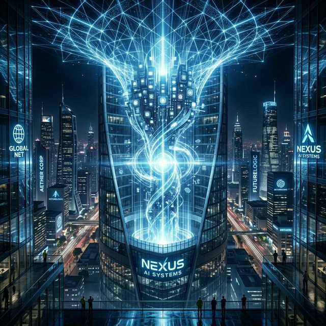

# 两年反超老东家？Anthropic 营收爆炸式增长背后的企业级阳谋

## 导语

2023 年，OpenAI 曾以 50% 的绝对市占率独霸企业 AI 市场。仅仅两年多过去，格局正在发生剧烈倒转。

根据最新公开数据，由前 OpenAI 核心研发总监 Dario Amodei 创办的 Anthropic，在 2026 年初已实现超过 10 倍的爆炸式营收增长，其年化营收（ARR）达到惊人的 140 亿美元，并正快速逼近 200 亿美元大关。在部分核心商业指标上，Claude 甚至已经完成了对“老东家”OpenAI 的反超。

围绕“Claude 是如何登顶全球第一”的讨论愈演愈烈，这背后不仅是模型能力的较量，更是一场深刻的 B2B 商业策略之争。

## 核心信息

公开数据及业界权威机构的统计揭示了以下几项关键事实：

1. **企业支出份额的历史性反转**：在当前的全球企业级大模型支出中，Anthropic 占据了高达 **40%** 的份额，而 OpenAI 的占比回落至 27%。特别是在 2026 年首次采购 AI 服务的企业中，约 **70%** 的客户直接选择了 Anthropic。
2. **统治代码生成市场**：凭借极强的长文本和逻辑处理能力，在核心的“企业级编程协助”细分市场，Claude Code 的市场占有率达到了压倒性的 **54%**，而 OpenAI 仅剩 21%。
3. **“纯粹”的商业模式**：与 OpenAI 庞大的 C 端订阅体系不同，Anthropic 极度聚焦 B 端。其 **70% - 75%** 的收入全部来自 API 调用带来的计费，证明了企业对 Claude 日常核心业务工作流的高频依赖。

## 背景补充：Dario Amodei 的“安全阳谋”

当年离开 OpenAI 时，Dario Amodei 团队最大的分歧点在于对 AI 安全原则的分歧。如今，这一看似制约的“紧箍咒”，反而成了 Anthropic 打进高端政企市场的最强通行证。

- **国家安全级别的信任**：就在近期，Claude 成为首个获准在美国国防和高机密政府部门部署的前沿 AI 系统。
- **云厂商绑定策略**：Anthropic 并没有像 OpenAI 深度绑定微软一样把自己锁死，而是通过接入 AWS (Amazon Bedrock) 和 Google Cloud (Vertex AI) 等多云生态，巧妙且快速地渗透进了全球 500 强的现有 IT 架构之中。

## 影响分析：大模型行业的下半场属于 Agent

如果说前两年是拼“做题分数”，那么 2026 年比拼的是“真实落地”。

1. **B端信任建立壁垒**：Anthropic 展现了这样一个事实：企业客户不在乎模型多会跟人“聊天”，而在乎其稳定性、可控性（如内部宪法 AI 的引导）及不泄露数据的安全承诺。
2. **迈向全自动智能体（Agent）**：最新的 Claude Opus 4.6 已展露出强大的 Agentic 能力，从撰写企划到接管中小企业库存和定价测试。Anthropic 在高频刚需的生产力场景上，构筑了几乎不可替代的壁垒。
3. **估值的重新定义**：在完成新一轮 300 亿美元的融资后，Anthropic 估值飙升至难以置信的 3800 亿美元量级。这反映了资本市场对“API消耗驱动”这一更健康商业模式的高度认可。

## 总结

“超越 OpenAI”并不仅仅是一个博眼球的 YouTube 标题。目前的公开数据显示，虽然 OpenAI 在 C 端知名度和绝对用户数上依然强大，但在高净值的**企业级市场（B2B）**，Anthropic 的 Claude 确实已经实现了局部甚至是核心财务上的逆袭。

Dario Amodei 用实力证明，不靠炒作噱头，甚至带有一点“极客式克制”的稳健做派，才是拿下企业核心钱袋子的最优解。至于这场“第一宝座”的争夺谁能笑到最后，仍取决于接下来多模态（尤其是物理推理层面）的进一步角力。

## 信息来源

### P0

- Anthropic 官方发布：最新融资情况、Claude 4.6 产品更新及多云集成公告。
- Dario Amodei 的多篇内部信及声明，详见其深度剖析文章《Machines of Loving Grace》。
- 官方确认获批美国国家安全级别机密数据处理相关资格。

### P1

- Deep Research Global/SaaStr：2026 企业级大模型渗透率、API 收入占比及代码市场份额研究。
- 彭博社及 The Register：对 2025-2026 两家核心 AI 企业营收预测和市占率走势图跟踪报道。

---
*注：部分关于“全面登顶第一”的论述基于现阶段特定细分市场（如代码生成和新增企业订阅客户占比）的统计特征，整体行业格局仍在高速演变中。*
