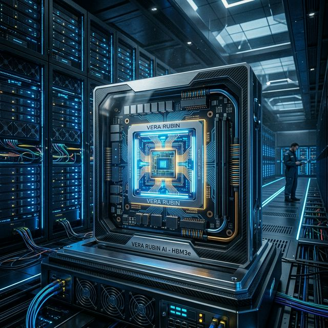
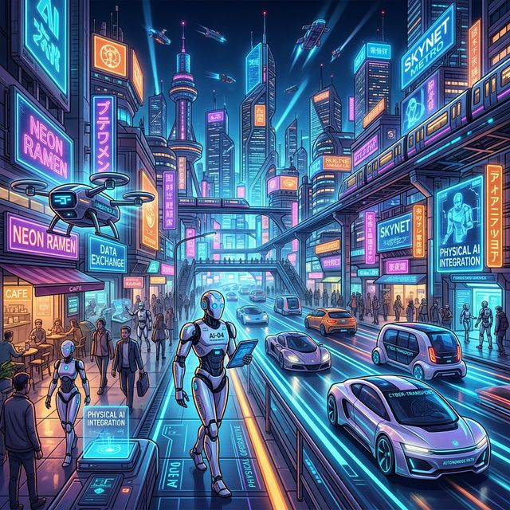

# 黄仁勋 GTC 2026 演讲核心：Vera Rubin 架构发布，AI 迈向“推理”与“物理世界”

## 导语

2026年3月16日，英伟达年度 AI 盛典 GTC 2026 在加州圣何塞开幕。在备受瞩目的两小时主题演讲中，黄仁勋不仅带来了采用最新 3nm 工艺的下一代芯片架构 Vera Rubin，更向外界传递了一个关键信号：人工智能的重心正在从“模型训练”阶段，全面跨入“推理”与“物理世界”阶段。

这不仅是一场硬件发布，更是英伟达对未来五年智能基础设施发展方向的定调。

## 核心信息

### Vera Rubin 架构：350倍推理性能飞跃

在此次大会上，英伟达正式揭晓了备受期待的 **Vera Rubin 平台**以及配套的 Vera CPU。新架构采用了尖端的 3nm 制程工艺以及 HBM4 高带宽内存。

根据官方预计，Vera Rubin 平台在推理（Inference）性能上将实现**高达350倍的提升**，这标志着算力架构开始深度向大模型落地应用倾斜。此外，为开发 AI 智能体（AI Agents）打造的 NeMoClaw 软件层也同步亮相，意在完善英伟达的软硬件护城河。

### 战略拐点：从“训练”走向“推理”

黄仁勋在演讲中明确表示，AI 行业正在经历一次重大阶段性转变——大模型的“训练时代”正在逐步过渡到大规模的“推理时代”。
这意味着 AI 系统将在实际业务中开始高频、实时地执行计算任务，进而导致算力需求呈现指数级增长。

## 背景补充：万亿美元级别的基础设施投资

除了硬件参数的更新，黄仁勋还展望了 AI 经济的宏观格局。他将未来的 AI 产业比作一个“五层蛋糕”：涵盖能源、芯片、基础设施、模型和最终应用。在这套庞大的体系中，英伟达的目标是“定义 AI 经济的底层实体工厂”。

**巨大的算力缺口：**
受限于推理阶段的爆发式需求，黄仁勋预测，全球数据中心在未来五年内将迎来规模达一万亿美元的新增投资。同时，由于市场对高性能算力的渴求，英伟达保守估计其 Blackwell 以及全新 Vera Rubin 系统到 2027 年的累计需求订单也将突破一万亿美元级别。

值此 CUDA 平台诞生 20 周年之际，英伟达已经在这场“基建狂潮”中建立了一套难以逾越的完整生态体系。

## 影响分析：物理 AI 成为下半场主角

值得重点关注的是，这也是黄仁勋在 GTC 重点强调“物理 AI”（Physical AI）的时刻。

在此之前，生成式 AI 的突破主要集中在数字世界（如文本、代码和图像生成）。而随着算力和算法的成熟，AI 正在向物理世界延伸——**机器人学与自动驾驶技术**将成为新的确定性增长极。

这对于行业意味着：
1. **开发者生态的外延：** 开发工具将逐渐从纯软件的框架（如 PyTorch）向软硬件协同的模拟及实体控制工具迁移。
2. **边缘算力的爆发：** 物理 AI 要求极低延迟和极高可靠性，这将推动终端及边缘计算芯片市场的繁荣。
3. **传统企业的入局点：** 制造、仓储、交通等传统行业将迎来真正的“Agent 化”改造。

## 总结

相较于过去单纯追求参数规模提升的叙事，黄仁勋在 GTC 2026 的演讲传递了浓厚的“落地”与“基建”意味。Vera Rubin 架构的发布及其恐怖的推理性能提升，为大模型在各行各业的“平价使用”扫清了硬件障碍。

未来三年，谁能在这个万亿美元级别的新基建市场中快速部署好基于物理 AI 的应用，谁就能在下一个计算周期中抢占先机。

## 信息来源

### P0

- 英伟达 GTC 2026 官方 Keynote 直播及相关产品推介
- 官方发布的新一代 Vera Rubin 架构及 Vera CPU 软硬件规格说明

### P1

- 彭博社、路透社等主流媒体对英伟达 万亿美元市场需求 的跟踪报道
- 科技领域主流硬件与 AI 分析机构对“物理 AI”及推理时代拐点的分析

---
*注：部分市场预测数据（如未来五年全球数据中心投资额）基于发布会公开的愿景规划，具体落地规模受宏观经济及供应链产能等因素影响，存在一定观察空间。*
